# Inspiration One 技术架构与模块设计手册

更新时间：2026-06-07

本文面向后续开发、审查和接手维护，描述 Inspiration One 当前代码实现中的整体架构、模块设计、数据主线、运行时边界和扩展约定。本文以当前仓库代码为准，补充 `docs/ARCHITECTURE.md` 中没有展开的模块内设计。

## 1. 系统定位

Inspiration One 是自托管灵感产物素材工作台。核心链路覆盖灵感产物资料、参考图、结构化文案、工作流生图、连续图片会话、生成图画廊、供应商配置、RBAC 和运行状态治理。

当前部署模型是单实例应用，支持一个初始管理员账号和多个由管理员创建的授信用户。用户权限由 RBAC 菜单权限、API 权限和生成资源分组授权共同决定。

## 2. 运行拓扑

```text
Browser
  -> React/Vite Web
    -> FastAPI API
      -> PostgreSQL
      -> Redis / Dramatiq broker
      -> local / MinIO / S3 storage
      -> text providers
      -> image providers
    -> Dramatiq worker
      -> same PostgreSQL, Redis, storage and providers
```

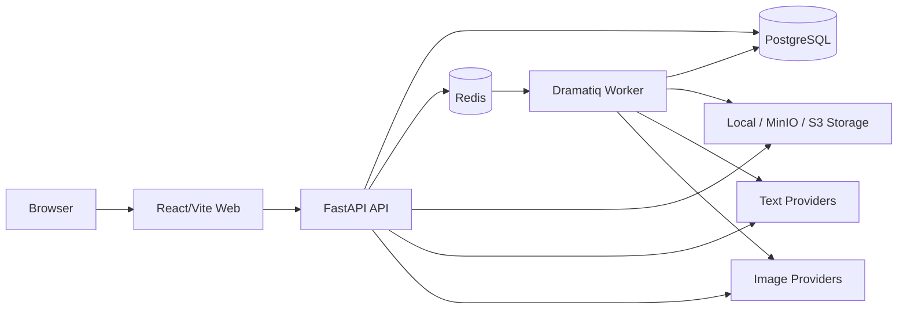

进程职责：

- Web：React 19 + Vite + TypeScript 前端，生产环境由 nginx 静态服务承载。
- API：FastAPI 应用，负责鉴权、输入校验、用例编排入口、状态查询、文件下载和设置管理。
- Worker：Dramatiq actor 执行灵感产物工作流、文案/图片生成、连续生图任务恢复和后台任务推进。
- PostgreSQL：元数据、运行状态、权限、配置、任务和归档记录的权威存储。
- Redis：Dramatiq 消息投递和后台任务队列，不作为业务状态权威源。
- Storage：本地文件、MinIO 或 S3 兼容对象存储，数据库只保存对象身份字段。
- Provider：文本和图片模型供应商，通过 provider profile、binding、generation config 和调度器间接调用。

启动与部署：

- 本地开发使用根目录 `justfile`：`just backend-run`、`just backend-worker`、`just web-dev`。
- 后端迁移使用 `just backend-migrate`。
- 后端测试使用 `just backend-test`。
- 前端验证使用 `pnpm --dir web lint`、`pnpm --dir web test:run`、`just web-build`。
- Docker Compose 自托管路径构建 API、worker 和 Web；PostgreSQL、Redis、MinIO 可由外部共享中间件提供。

## 3. 后端分层

后端位于 `backend/src/inspiration_one_backend/`，采用四层结构。

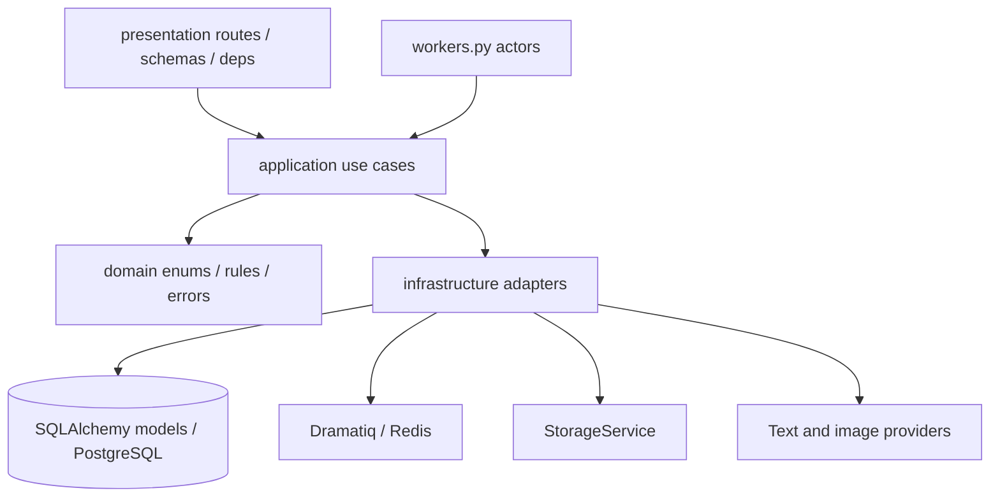

### 3.1 presentation

目录：`presentation/`

职责：

- FastAPI app 创建、路由注册、中间件和错误映射。
- HTTP 请求参数、multipart 上传、session cookie、权限依赖和 Pydantic DTO。
- 把 application 层返回的 ORM/domain 对象序列化为 API 响应。

关键文件：

- `presentation/api.py`：注册 auth、inspirations、inspiration_workflows、image_sessions、gallery、settings、rbac、status 等 router。
- `presentation/deps.py`：当前用户、管理员、API 权限、Session 注入等依赖。
- `presentation/routes/*.py`：按资源拆分 API。
- `presentation/schemas/*.py`：请求/响应模型和 serializer。
- `presentation/upload_validation.py`：上传 MIME、大小、像素和数量限制。
- `presentation/errors.py`：业务异常到 HTTP 状态码的边界转换。

约定：

- 路由层只做 HTTP 边界工作。
- provider 调用、数据库状态迁移、任务提交和文件落盘进入 application/infrastructure。
- 不在页面或路由中拼接存储路径，下载走受控 route。

### 3.2 application

目录：`application/`

职责：

- 灵感产物、文案、工作流、连续生图、画廊、权限和调度相关用例。
- 组合数据库、storage、queue、provider 等基础设施能力。
- 管理业务事务、任务状态、失败分类、重试/取消语义和资源归属。

关键模块：

- `auth.py`：用户、角色、菜单/API 权限、登录、设密 token 和密码哈希。
- `use_cases.py`：灵感产物创建、素材、文案、海报、历史和删除保护等主链路。
- `image_sessions.py`：连续生图会话、参考图、round、durable task、挂回灵感产物和投画廊。
- `image_session_generation_request.py`：连续生图请求组装、参考图/基图校验、tool options 和 batch 参数。
- `image_generation_core.py`：工作流生图和连续生图共享的图片引用、tool options、provider 输出元数据。
- `generation_config_runtime.py`：运行时 generation config claim/release、失败原因、超时/限流识别。
- `queue_submission.py`：持久化任务行已创建但队列投递失败时的统一处理。
- `usage_stats.py`：按用户统计生成尝试、成功、失败、超时和生成单元数。
- `canvas_templates.py`：内置画布模板 contract、校验和目录能力。
- `inspiration_workflows.py`：灵感产物工作流稳定 facade。
- `inspiration_workflow/*`：灵感产物 DAG 工作流的内部实现。

### 3.3 domain

目录：`domain/`

职责：

- DB-free 的枚举、规则和小型领域概念。
- 供 application、presentation 和前端 DTO 字符串值共享。

关键模块：

- `enums.py`：灵感产物状态、素材类型、文案状态、任务状态、海报类型、工作流节点类型、图片会话资产类型等。
- `errors.py`：`BusinessValidationError`、`NotFoundError` 等业务异常。
- `rbac.py`：菜单/API 权限代码、管理员角色、权限种子定义。
- `workflow_rules.py`：DAG 拓扑、选择节点执行计划、缺失上游判断等纯规则。
- `durable_generation_tasks.py`：durable task 状态契约。

### 3.4 infrastructure

目录：`infrastructure/`

职责：

- SQLAlchemy models/session。
- storage adapter。
- Dramatiq broker、任务投递和恢复。
- 文本/图片 provider 接口、factory 和具体实现。
- 本地海报 renderer。

关键模块：

- `db/models.py`：所有 ORM 模型。
- `db/session.py`：engine、Session factory、FastAPI dependency。
- `provider_config.py`：供应商档案、生成资源分组、generation config、调度状态和统计。
- `storage.py`：本地/对象存储门面、动态 URL、缓存和受控下载基础能力。
- `queue.py`：Dramatiq broker、enqueue、恢复 queued/running 任务。
- `openai_client.py`：OpenAI compatible client 参数，当前默认 timeout 为 120 秒。
- `text/*`：文本 provider interface/factory/mock/OpenAI compatible。
- `image/*`：图片 provider interface/factory/mock/OpenAI Responses/Images/Gemini/chat service。
- `poster/renderer.py`：Pillow 模板海报渲染。

## 4. 数据模型设计

ORM 模型集中在 `infrastructure/db/models.py`。PostgreSQL 是唯一业务状态源，Redis 只承担投递。

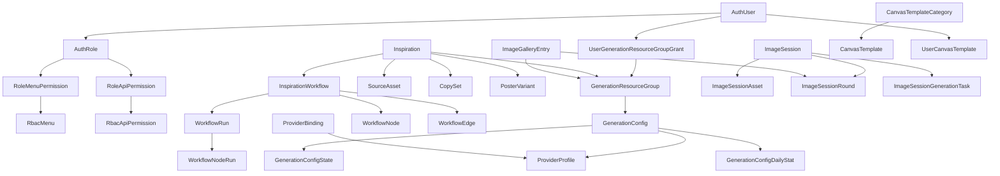

### 4.1 身份、权限和用量

```text
AuthRole
AuthUser
RbacMenu
RbacApiPermission
RoleMenuPermission
RoleApiPermission
UserDailyUsageStat
```

设计要点：

- 初始管理员账号为 `libow`，管理员角色拥有所有菜单/API 权限。
- 管理员初始设密凭据使用环境变量 `ADMIN_ACCESS_KEY`。
- 普通用户由管理员创建，创建/重置密码时返回一次性设密凭据。
- 密码存储使用 `scrypt`，旧版 `md5(client_md5:salt)` 在明文登录成功后升级。
- 前端登录和设密发送 `password`，旧客户端提交 `client_password_md5` 仍兼容校验。
- 设密 token 只保存加盐 SHA-256 摘要和过期时间，响应中只在创建/重置时返回明文 token。

### 4.2 供应商、生成配置和资源分组

```text
GenerationResourceGroup
UserGenerationResourceGroupGrant
ProviderProfile
ProviderBinding
GenerationConfig
GenerationConfigState
GenerationConfigDailyStat
```

设计要点：

- `GenerationResourceGroup` 是用户在生成入口选择的业务分组。
- 管理员可使用所有启用、未归档分组；普通用户只能使用授权分组。
- `GenerationConfig.resource_group_id` 决定该配置属于哪个业务分组。
- 生成入口只传 `resource_group_id`，调度器在该分组内选择具体 config。
- `default` 只是普通业务分组 key，不表达系统兜底。
- `GenerationConfigState.current_concurrency` 是调度并发状态，claim 时 SQL 原子递增，release 时 SQL 原子递减到不小于 0。
- `GenerationConfigDailyStat` 记录每日成功、失败、超时、限流、冷冻和生成单元数。

### 4.3 灵感产物素材主链路

```text
Inspiration
SourceAsset
CreativeBrief
CopySet
PosterVariant
```

设计要点：

- `Inspiration.resource_group_id` 保存当前灵感/灵感产物列表归属分组，表示最后一次选择并成功使用的分组。
- `SourceAsset` 保存灵感产物原图、参考图、处理图、上下文图和上下文文档等素材。
- `CopySet` 保存结构化文案 payload，可被工作流生图读取。
- `PosterVariant` 保存主图或促销海报产物。
- 资源本体不直接承担业务分组筛选语义；列表归档记录或产品字段承担筛选标签。

### 4.4 灵感产物 DAG 工作流

```text
InspirationWorkflow
WorkflowNode
WorkflowEdge
WorkflowRun
WorkflowNodeRun
```

设计要点：

- 一个灵感产物有活动 workflow。
- 节点类型包括 `inspiration_context`、`reference_image`、`copy_generation`、`image_generation`、`tail_splitter`。
- `WorkflowEdge` 形成 DAG，拓扑和选择节点执行计划由 domain/application 规则校验。
- `WorkflowRun` 记录一次工作流运行，`WorkflowNodeRun` 记录节点级执行。
- 工作流 status 接口只返回轻量 run/node 状态，完整 workflow 接口返回节点配置、输出和运行历史。
- 运行中前端轮询 status，结束后刷新完整 workflow、灵感产物和历史产物。

### 4.5 连续生图和画廊

```text
ImageSession
ImageSessionAsset
ImageSessionRound
ImageSessionGenerationTask
ImageGalleryEntry
```

设计要点：

- `ImageSession` 是连续生图会话，可关联灵感产物。
- `ImageSessionAsset` 保存参考图和生成图资产。
- `ImageSessionRound` 每行表示一个生成候选，保存 prompt、尺寸、模型、provider 状态和分组标签。
- `ImageSessionGenerationTask` 是 durable 异步任务行，记录队列、运行、失败、取消和候选进度。
- `ImageGalleryEntry` 是画廊归档记录，按分组筛选。
- 运行中只轮询 session status，完成后刷新完整 session。

### 4.6 模板、设置和审核

```text
AppSetting
CanvasTemplateCategory
CanvasTemplate
UserCanvasTemplate
```

设计要点：

- `AppSetting` 保存运行时业务配置覆盖，不保存 env-only 基础设施 secret。
- 内置和全局画布模板使用 `CanvasTemplate`；个人节点组模板使用 `UserCanvasTemplate`。
- 模板只保存可复用配置、节点规格和内部连线，不保存产物、文件路径、运行结果或灵感产物 ID。
- 多个资源模型带有启用/归档/审核字段，用于展示、屏蔽和恢复。

## 5. 灵感产物工作流模块内设计

灵感产物工作流是 Inspiration One 的核心工作台，用 DAG 表示生产链路。

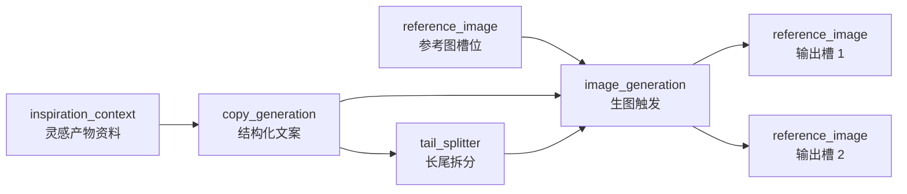

### 5.1 节点语义

- `inspiration_context`：灵感产物资料入口，保存名称、上下文长文、上下文图片、上下文文档和动态字段。
- `reference_image`：单图槽位。手动上传或上游生图填充会替换当前图，旧图保留为灵感产物素材历史。
- `copy_generation`：读取灵感产物上下文和上游文本，生成可编辑结构化文案。
- `image_generation`：触发图片生成，不直接承载图片产物；生成结果填充下游 `reference_image`。
- `tail_splitter`：把长尾/批量需求拆分为多个可应用的下游节点配置。

### 5.2 子模块边界

- `graph.py`：加载活动工作流、默认图、拓扑排序、节点/边查找、latest run 排序。
- `mutations.py`：节点/边创建、更新、删除、上传/绑定图片、编辑文案、节点修复。
- `execution.py`：运行启动、选中节点计划、节点 dispatch、run 生命周期编排。
- `run_state.py`：节点领取、失败/取消标记、容量等待、状态迁移。
- `context.py`：收集灵感产物上下文、上游文本、参考图、下游参考图目标和 config 解析。
- `artifacts.py`：工作流局部 copy set、参考图填充、产物摘要、海报转参考图。
- `image_generation.py`：生图节点执行、provider 调用、批量/串行目标处理、超时和失败分类。
- `tail_splitter.py`：尾巴拆分计划和应用。
- `templates.py`：内置/global 模板物化到 workflow。
- `user_templates.py`：个人节点组模板保存、列表、重命名、归档和应用。
- `query.py`：执行热路径需要的窄查询服务。

### 5.3 生图目标语义

- 下游连接了多少个 `reference_image` 节点，就生成多少张图片。
- 没有下游参考图时，后端拒绝执行。
- 支持 `generate_poster_images` 的 batch provider 在一个 provider 调用中生成多目标。
- 不支持 batch 的 provider 在同一个 image config claim 下串行调用多次，避免一个用户任务占用多个并发名额。
- provider 调用失败会转换为用户可读的工作流失败原因。

### 5.4 运行和恢复

- 工作流运行写入数据库后投递队列。
- enqueue 失败时把 run 标记为失败，避免 active run 卡死。
- API/worker 启动时恢复未完成 run。
- 同一灵感产物避免重复 active run。
- 运行中 status 响应携带队列、运行、失败、取消和 retry/cancel 能力。

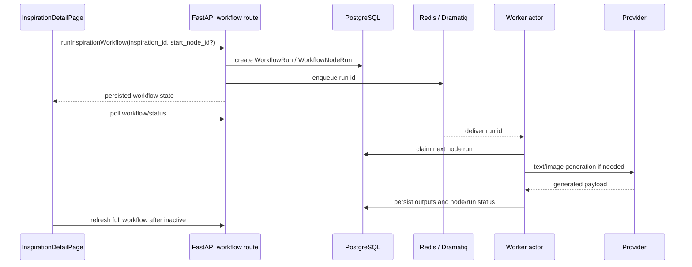

## 6. 连续生图模块设计

连续生图由 `ImageSession`、round 和 durable task 组成。

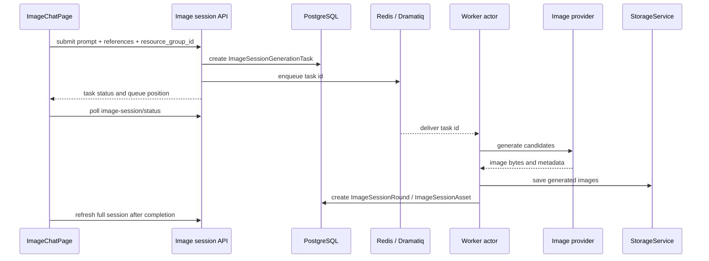

### 6.1 用户模型

- 用户创建或选择会话。
- 可上传多张参考图。
- 可从历史候选继续生成，也可选择参考图作为下一轮输入。
- 生成结果可下载、投画廊、保存为灵感产物参考图或作为灵感产物主图参考。

### 6.2 后端执行

- `image_sessions.py` 管理会话、资产、round、task 和挂回灵感产物。
- `image_session_generation_request.py` 负责生成请求组装。
- `infrastructure/image/chat_service.py` 适配图片 provider 的连续生图能力。
- durable task 保存 `progress_updated_at`、已完成候选、provider response id/status 和失败信息。
- 重复消息遇到 terminal 或当前 running 状态时 no-op。

### 6.3 前端状态

- `ImageChatPage.tsx` 持有会话选择、生成表单、移动端布局和候选历史。
- 运行中轮询 `image-session-status`，只合并轻量状态。
- 完成后刷新完整 session、画廊和关联灵感产物相关查询。

## 7. Provider 和调度设计

### 7.1 Provider 抽象

文本 provider 接口：

- `generate_brief(inspiration_input)`
- `generate_copy(inspiration_input, brief, config, reference_images=None)`

图片 provider 接口：

- 单图生成。
- 可选多图 batch 生成。
- 连续生图由 chat service 适配 provider 能力。

当前实现：

- 文本：`mock`、OpenAI compatible Responses。
- 图片：`mock`、OpenAI Responses image tool、OpenAI Images、Google Gemini image。

### 7.2 配置对象

- `ProviderProfile` 保存 provider 类型、base URL、模型连接信息和 secret。
- `ProviderBinding` 把用途绑定到 profile。
- `GenerationConfig` 定义用途、模型、prompt、能力分组、最大并发、失败冷却和排序权重。
- `GenerationConfigState` 维护实时并发、失败窗口、冷冻时间和最后使用时间。

### 7.3 调度过程

```text
generation entry
  -> validate resource_group_id and user grant
  -> claim_generation_config(purpose, resource_group_id)
  -> current_concurrency + 1 atomically
  -> call text/image provider
  -> release_generation_config_claim(...)
  -> current_concurrency - 1 atomically, lower bounded by 0
  -> record daily stat and user usage
```

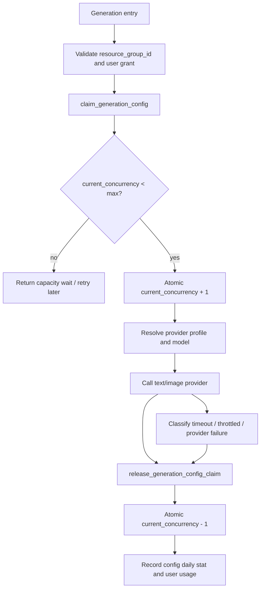

失败治理：

- 失败次数达到配置阈值后进入冷冻窗口。
- 超时、限流、配额等错误会被分类并记录。
- Responses 后台轮询有总 deadline，超时抛 `TimeoutError` 并进入通用超时统计。
- OpenAI compatible client 默认请求 timeout 为 120 秒。

## 8. RBAC 和安全设计

### 8.1 认证

- `POST /api/auth/password` 是公开设密入口，但必须提交一次性 `setup_token`。
- 管理员初始设密 token 是 `ADMIN_ACCESS_KEY`。
- 普通用户 setup token 由 RBAC 创建用户或重置密码时一次性返回。
- 密码使用 `scrypt` 保存。
- 旧 MD5 客户端兼容登录，但只有明文密码登录成功才升级旧哈希。
- session cookie 由 `SESSION_SECRET` 签名。

### 8.2 授权

权限有三层：

- 页面菜单权限：控制前端可进入哪些主页面。
- API 权限：后端依赖校验具体接口能力。
- 生成资源分组授权：控制用户能选择哪些业务分组进行文案/图片生成。

管理员：

- 拥有所有菜单和 API 权限。
- 可使用所有启用、未归档生成资源分组。
- 管理角色、用户、分组授权、供应商和生成配置。

普通用户：

- 只能访问被角色授予的菜单/API。
- 只能使用被授权的生成资源分组。
- 不允许创建第二个管理员，不允许重置管理员密码。

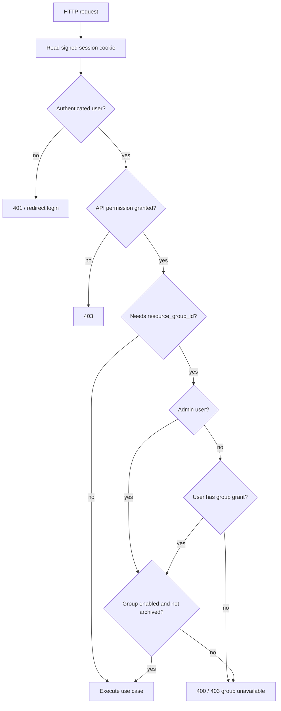

### 8.3 Secret 和上传保护

- `DATABASE_URL`、`REDIS_URL`、`SESSION_SECRET`、`ADMIN_ACCESS_KEY` 等是 env-only。
- Provider API key 可来自 env 或数据库配置，API 响应不回显 secret。
- 上传文件受 MIME、大小、像素和数量限制。
- 用户可下载文件必须走受控下载接口。

## 9. 前端架构

前端位于 `web/src/`，技术栈为 React 19、Vite、TypeScript、React Router、TanStack Query、Tailwind CSS。

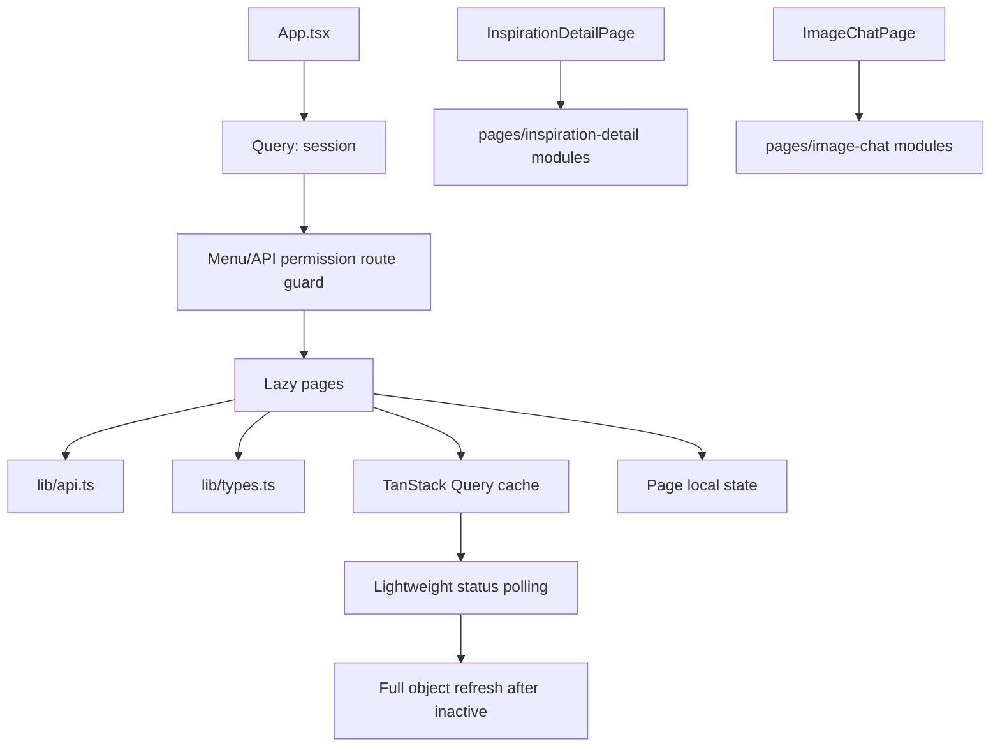

### 9.1 应用入口

- `main.tsx`：ReactDOM mount。
- `App.tsx`：QueryClient、BrowserRouter、session query、权限路由和 lazy page。
- `lib/session.tsx`：把 session state 提供给页面和组件。
- `lib/preferences.tsx`：语言/主题偏好。

### 9.2 路由

当前页面：

- `/login`：登录和初始设密。
- `/inspirations`：灵感/灵感产物列表，按生成资源分组单选筛选。
- `/inspirations/new`：创建灵感产物，必须选择可用分组。
- `/inspirations/:inspirationId`：灵感产物详情和 DAG 工作台。
- `/workflow/templates`：个人模板管理。
- `/image-chat`：独立连续生图。
- `/inspirations/:inspirationId/image-chat`：灵感产物关联连续生图。
- `/gallery`：生成图画廊，按分组筛选。
- `/help`：产品内帮助。
- `/settings`：运行时设置、provider、生成配置和资源治理。
- `/settings/global-templates`：全局模板管理。
- `/rbac`：用户、角色和生成资源分组授权。
- `/status`：生成配置状态。
- `/usage-stats`：用户用量统计。

### 9.3 API 和类型

- `lib/api.ts` 是唯一 fetch 封装位置，负责 credentials、base URL、错误处理和路径。
- `lib/types.ts` 保存前端 DTO，字段保留后端 `snake_case`。
- `lib/rbac.ts` 保存菜单/API 权限判断。
- `lib/imageToolOptions.ts`、`lib/imageSizes.ts` 管理图片工具参数和尺寸。
- 页面不直接写裸 `fetch`。

### 9.4 状态管理

- 服务端状态使用 TanStack Query。
- 表单草稿和画布交互使用页面本地 state。
- 不使用全局 store。
- 工作流和连续生图运行中使用轻量 status 轮询，完成后刷新完整对象。
- 灵感产物工作台节点拖拽位置由 ReactFlow 管理运行中位置，drop 后更新后端并做乐观缓存保护。

### 9.5 页面模块设计

- `InspirationListPage.tsx`：分组筛选、搜索、分页、删除、导航。
- `InspirationCreatePage.tsx`：灵感产物入口类型、原图/参考图/文档上传、模板选择、分组选择。
- `InspirationDetailPage.tsx`：灵感产物详情、工作流画布、运行历史、图库、模板、节点 inspector。
- `pages/inspiration-detail/*`：InspirationDetail 的局部组件、workflow config、ReactFlow adapter、选择/快捷键/图库映射。
- `ImageChatPage.tsx` 和 `pages/image-chat/*`：连续生图主视图、会话抽屉、历史分支、移动端布局、参考面板。
- `GalleryPage.tsx`：画廊列表、预览、下载和分组筛选。
- `SettingsPage.tsx`：运行时配置、provider profile、binding、generation config、资源分组、导入导出。
- `RbacPage.tsx`：用户/角色/权限管理，创建/重置用户时展示一次性设密凭据。
- `StatusPage.tsx`：生成配置池状态、失败冷却、统计。
- `UsageStatsPage.tsx`：用户维度用量统计。
- `TemplateManagementPage.tsx`：个人/全局模板管理。

## 10. API 模块边界

主要 router：

- `/api/auth`：登录、设密、session 状态和登出。
- `/api/inspirations`：灵感产物创建、列表、详情、删除、参考图、文案、海报/素材下载、历史。
- `/api/inspirations/{id}/workflow` 和 `/api/workflow-*`：工作流查询、模板、节点、边、运行、取消、重试。
- `/api/image-sessions`：连续生图会话、参考图、生成、取消、重试、保存到灵感产物。
- `/api/gallery`：画廊列表和创建条目。
- `/api/settings`：运行时设置、provider、generation config、资源分组、导入导出、状态选项。
- `/api/rbac`：用户、角色、权限目录、角色权限、用户分组授权、密码重置。
- `/api/generation-queue`：全局生成队列概览。
- `/api/usage-stats`：用户用量统计。
- `/api/moderation` 和 `/api/resource-moderation`：资源启用/恢复/审核状态。

路由新增原则：

- 新资源建独立 route 和 schema 文件。
- 复用 `presentation/deps.py` 权限依赖。
- 业务异常使用 application/domain error，路由只映射 HTTP。
- 前端 API 方法同步加入 `lib/api.ts`，DTO 同步加入 `lib/types.ts`。

## 11. 配置设计

配置分两类。

### 11.1 env-only

应用访问数据库前必须可用，或属于部署级 secret：

- `DATABASE_URL`
- `REDIS_URL`
- `SESSION_SECRET`
- `ADMIN_ACCESS_KEY`
- 基础 CORS、storage、S3/MinIO 连接等部署参数

这些配置不支持数据库覆盖。

### 11.2 运行时业务配置

可由 env 默认值或 `app_settings` 覆盖：

- provider 和模型默认值。
- 图片尺寸、图片工具参数。
- 上传限制。
- 任务重试、并发、超时。
- 海报模式。
- prompt 模板。
- 业务删除开关。
- 生成资源分组、provider profile、binding 和 generation config。

设置页保存 secret 时不回显已有值。恢复数据库覆盖值不属于业务删除保护。

## 12. 存储和下载设计

`StorageService` 是统一门面，`LocalStorage` 是兼容别名。

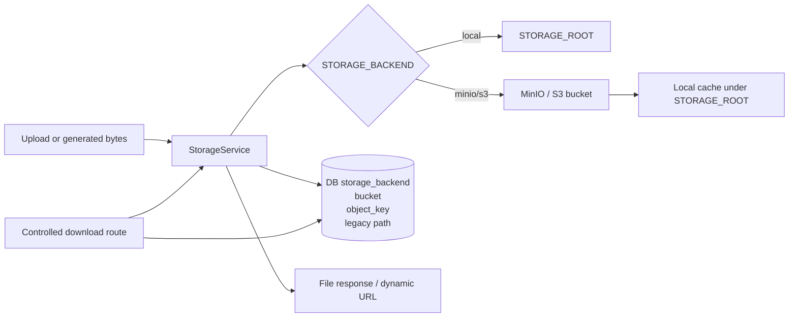

后端支持：

- `local`：文件落到 `STORAGE_ROOT`。
- `minio`：S3 兼容对象存储，开发默认可接共享 MinIO。
- `s3`：其他 S3 兼容后端。

数据库资源行保存：

- `storage_backend`
- `storage_bucket`
- `storage_object_key`
- legacy `storage_path`

响应阶段按当前 storage 配置动态拼接访问 URL。本地存储或无公共 URL 时使用受控下载接口。

受控下载入口：

- `/api/posters/{poster_id}/download`
- `/api/source-assets/{asset_id}/download`
- `/api/image-session-assets/{asset_id}/download`

## 13. 异步任务和并发治理

### 13.1 Durable 任务原则

- 业务任务行先写数据库。
- Redis 消息只负责投递。
- 投递失败时把任务标记为失败并暴露可读错误。
- API/worker 启动时恢复 queued 或 stale running 任务。
- worker 对重复 terminal 消息 no-op。

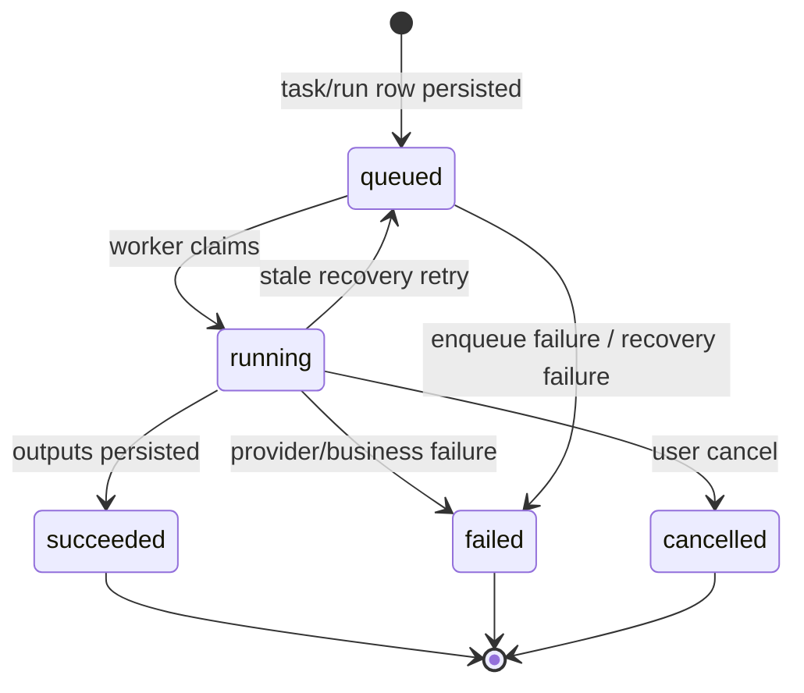

### 13.2 全局并发

全局生成并发基于数据库 active `WorkflowRun` 和 `ImageSessionGenerationTask` 计数。状态页和队列接口展示排队/运行概览。

### 13.3 生成配置并发

每个 `GenerationConfig` 有自己的 `max_concurrency` 和 `current_concurrency`。claim/release 通过数据库 update 完成，避免多个 worker 并发释放导致计数丢失。

### 13.4 超时和失败分类

- `TimeLimitExceeded` 和内置 `TimeoutError` 都按超时统计。
- provider 限流、配额、内容策略、网络、服务异常和参数不支持会转为用户可读分类。
- Responses 后台轮询有 deadline，避免永久 queued/in_progress。

## 14. 画布模板设计

模板类型：

- `full_canvas`：完整场景模板，可在创建灵感产物时初始化工作流，也可追加到已有工作台。
- `node_group`：节点组模板，用于复用选中节点和内部连线。

模板约束：

- 只支持 `inspiration_context`、`reference_image`、`copy_generation`、`image_generation` 等明确 allowlist 节点。
- 模板 graph 必须无环。
- 应用模板时物化为真实 `workflow_nodes` 和 `workflow_edges`。
- 追加内置 full canvas 时复用现有 inspiration context 单例。
- 用户节点组模板不允许包含 `inspiration_context`。
- 用户模板保存时清理产物字段，例如 asset id、poster id、run output、文件 URL/path。

## 15. 测试和质量门禁

后端：

- Ruff：`uv run --directory backend ruff check .`
- 全量测试：`just backend-test`
- 迁移约束：`tests/test_migrations_database_constraints.py`
- 重点覆盖：auth/rbac、route RBAC、generation config scheduler、workflow DAG、image sessions、provider payloads、storage/upload。

前端：

- Lint：`pnpm --dir web lint`
- 单测：`pnpm --dir web test:run`
- 类型和构建：`just web-build`
- 重点覆盖：API 封装、RBAC 权限、InspirationDetail helpers、ImageChat 布局/分支、Settings、Gallery helpers。

提交前基础检查：

- `git diff --check`
- 针对修改模块跑聚焦测试。
- 涉及 API/DTO 时同步后端 schema、前端 types、API 封装和测试。
- 涉及 schema 时新增 Alembic revision。

## 16. 扩展手册

### 16.1 新增后端 API

1. 在 `presentation/routes/` 新增或扩展 router。
2. 在 `presentation/schemas/` 定义 request/response。
3. 在 application 层实现用例。
4. 为路由绑定当前用户、管理员或 API permission dependency。
5. 在 `presentation/api.py` 注册 router。
6. 在 `web/src/lib/api.ts` 和 `web/src/lib/types.ts` 同步前端契约。
7. 增加 route 或 use case 测试。

### 16.2 新增数据库模型或字段

1. 更新 `infrastructure/db/models.py`。
2. 新增 Alembic revision。
3. 补迁移测试或相关业务回归。
4. 更新 serializer 和前端 DTO。
5. 明确历史数据 backfill 规则。

### 16.3 新增 provider

1. 在 `infrastructure/text` 或 `infrastructure/image` 增加实现。
2. 扩展 provider factory 和 capability/type 枚举。
3. 更新 `config.py` 运行时配置定义。
4. 更新 Settings 前端类型、表单和文案。
5. 增加 payload 组装、错误分类和 mock/fake 测试。
6. 不让 provider SDK 对象泄漏到 route 或 page。

### 16.4 新增工作流节点类型

1. 更新 domain enum 和前端 `WorkflowNodeType`。
2. 在 backend workflow graph/mutation/execution/context/artifact 模块明确语义。
3. 更新模板 allowlist 和模板校验。
4. 更新 InspirationDetail node display、inspector、actions 和 ReactFlow adapter。
5. 增加 DAG、运行、序列化和前端交互测试。

### 16.5 新增前端页面

1. 在 `web/src/pages/` 新增页面。
2. 在 `App.tsx` 增加 lazy route 和权限门禁。
3. API 请求放入 `lib/api.ts`。
4. DTO 放入 `lib/types.ts`。
5. 可复用 UI 放 `components/`，页面专属复杂组件放页面局部目录。
6. 使用 TanStack Query 管理服务端状态。

## 17. 当前边界和风险

当前明确边界：

- 不提供多租户隔离、支付、托管账号体系、自动投放或店铺授权。
- 不提供生产级审计后台和 WAF 配置。
- 资源对象级权限仍以当前单实例/RBAC 模型为主。

需要持续治理的风险：

- `presentation/routes/settings.py` 仍然较大，后续可按 provider、generation config、resource group、import/export 拆分。
- `InspirationDetailPage.tsx` 和 `SettingsPage.tsx` 仍是高复杂页面，后续应继续把纯逻辑和局部组件下沉到页面目录。
- 数据库中的 provider secret 目前依赖接口不回显保护，后续可补应用层加密或外部 secret manager。
- 国际化文案集中在单文件，功能继续增长时可按页面拆分。
- 对外技术文档应和根目录本文、`docs/ARCHITECTURE.md`、`docs/PRD.md` 保持同步。
